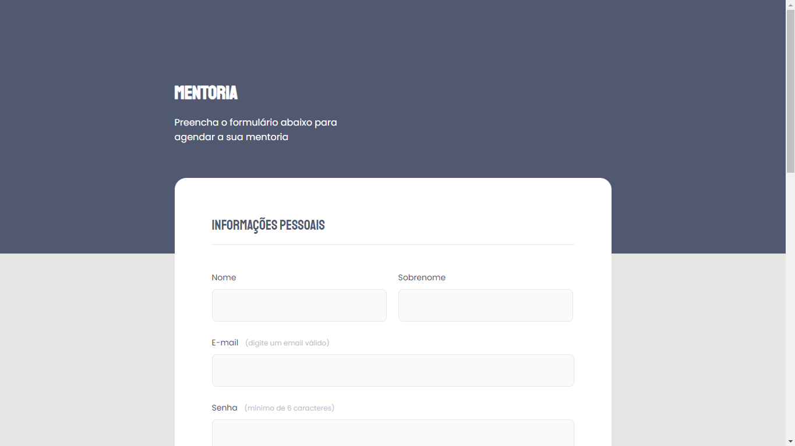

# Desafio Intermediário - Formulário Mentoria

🖼️ Layout do projeto - Desafio 05: Projeto Formulário Mentoria

# Conceitos Utilizados no Projeto

- Estruturando um projeto HTML;
- Uso de tags HTML mais comuns;
- Conceitos iniciais de CSS;
- Posicionamento e alinhamento de elementos na tela;
- Aplicando fontes customizadas;
- Espaçamentos.
- Campo select;
- Campo checkbox;
- Imagem centralizada no header.

# 🚀 Tecnoogias Utilizadas

- HTML
- CSS
- GitHub

# 📝 Licença

Esse projeto possui licença MIT.

#Projeto Online
Você pode visualizar o projeto online através
<a style="border: none;" href="https://chiarelo.github.io/DesafioRocketseat-FormularioStage03/" target="_blank">desse link</a>.
